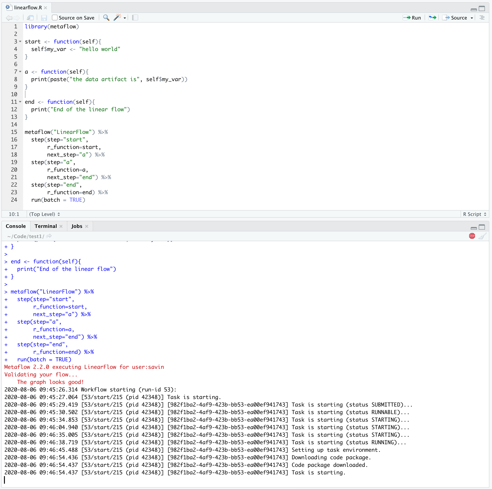

# Development Environment

You can install and use Metaflow easily within your favorite IDE, whether it is RStudio,  a Jupyter Notebook, vim/emacs on your terminal, or any other IDE. 

For editors like RStudio or Jupyter Notebook which allow you to directly execute the code from within their UI, you can execute your Metaflow flows as you would any other piece of R code. 

You can also use command-line arguments to execute your flows - 

Throughout this documentation, you will find instructions to both execute your flows from within an IDE like RStudio or directly from a terminal.

