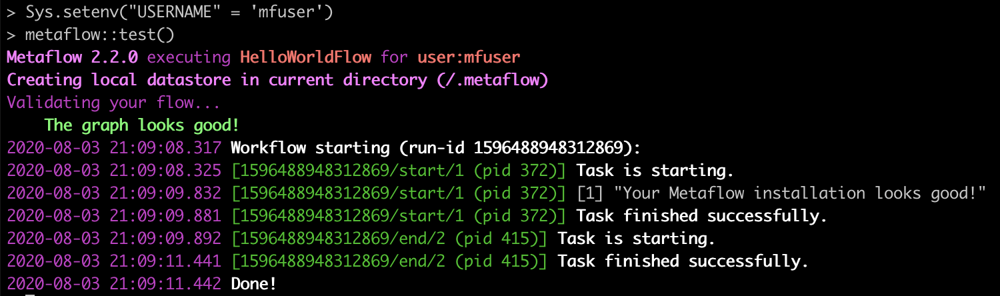

# Installing Metaflow

## Installing Metaflow R in MacOS or Linux

Metaflow R is available on our [GitHub repository](https://github.com/Netflix/metaflow) and it's coming to CRAN soon. You can install Metaflow R package using `devtools` in R:

```r
devtools::install_github("Netflix/metaflow@R-dev", subdir="R")
```

Metaflow R runs on top of the Metaflow python package. You can install the python package in R by

```bash
metaflow::install()
```


Metaflow requires **Python 3** in order to install the python package since Python 3 has fewer bugs and is better supported than [the deprecated Python 2.7](http://pythonclock.org)



If you're inside a conda environment or python virtual environment managed by reticulate in R, you would want to install in non-user mode as below. See details in the [Troubleshooting](install.md#error-can-not-perform-a-user-install) section below on this topic.

```bash
metaflow::install(user=FALSE)
```


If you run into any issue. Please checkout the [Troubleshooting](install.md#troubleshooting) section below.

To test that we have installed Metaflow successfully, use the following command to run a HelloWorld flow for sanity check

```bash
Sys.setenv("USERNAME" = 'mfuser')
metaflow::test()
```

You should be able to see an output like the following screenshot:



Please let us know [here](https://chat.metaflow.org) if you run into issues with installation.

Now you are ready to get your hands dirty with the [Tutorials](tutorials/).

## Installing Metaflow R in Windows 10 with WSL 2

The [WSL](https://docs.microsoft.com/en-us/windows/wsl/about) \(Windows Subsystem for Linux\) lets developers run a GNU/Linux environment inside Windows 10. If you already have WSL 2 installed in Windows 10, the installation process should be the same as for MacOS or Linux. The steps below are instructions on how to setup WSL 2 with Ubuntu 18.04, install R 3.6, and install Metaflow R.  
  
Once you're done with Step 1 - 3, which sets up a Ubuntu 18.04 with R, the rest should be the same with installation in MacOS/Linux [above](install.md#installing-metaflow-r-in-macos-or-linux). 

**Step 1**: Update your Windows 10 to be version 2004 or higher. Install WSL 2: please follow these [instructions](https://docs.microsoft.com/en-us/windows/wsl/install-win10). Choose Ubuntu 18.04 as the Linux distribution.

**Step 2:** Install R version 3.6 or later. Open Ubuntu 18.04 on Windows and run the following commands

```bash
sudo apt-key adv --keyserver keyserver.ubuntu.com --recv-keys E298A3A825C0D65DFD57CBB651716619E084DAB9
sudo echo "deb http://cran.wustl.edu/bin/linux/ubuntu bionic-cran35/" | sudo tee -a /etc/apt/sources.list
sudo apt update
sudo apt install r-base r-base-dev
sudo apt install libcurl4-openssl-dev libxml2-dev libssl-dev
```

**Step 3:** Install python3, pip3 and set them as alias for python, pip Inside Ubuntu 18.04 Windows

```bash
sudo apt-get install python3 python3-pip
cat "alias python=python3; alias pip=pip3" > ~/.bash_aliases
source ~/.bash_aliases
python --version
pip --version
pip install numpy pandas --user
```

**Step 4:** Install Metaflow R and run a test. Inside Ubuntu 18.04 on Windows, run R console and run the following commands

```r
install.packages('devtools', INSTALL_opts = c('--no-lock'))
devtools::install_github("netflix/metaflow@R-dev", subdir = "R")
metaflow::install()
metaflow::test()
```

**Step 5 \[Optional\]**: Setup RStudio Server in Ubuntu and access RStudio in a browser in Windows. Inside Ubuntu 18.04, run the following commands

```r
sudo apt install -y r-base r-base-core r-recommended r-base-dev gdebi-core build-essential libcurl4-gnutls-dev libxml2-dev libssl-dev
wget https://rstudio.org/download/latest/stable/server/bionic/rstudio-server-latest-amd64.deb
sudo gdebi rstudio-server-latest-amd64.deb
sudo rstudio-server start
```

You can access RStudio at [http://localhost:8787](http://localhost:8787) in your browser in Windows.

## Troubleshooting

### ERROR: Can not perform a '--user' install

If you see an error message **`ERROR: Can not perform a '--user' install`**when running `metaflow::install()`, which may happen when your R runs inside a python virtual environment, please run install in non-user mode:

```r
metaflow::install(user=FALSE)
```

### Error: Python shared library not found

If you see an error message **`Error: Python shared library not found`** when running `metaflow::install()`, you can setup a miniconda python environment using R library `reticulate` and run install inside the conda environment

```r
reticulate::install_miniconda()
reticulate::use_miniconda()
metaflow::install(user=FALSE)
```

### ModuleNotFoundError: No module named 'metaflow'

If you see the error message `ModuleNotFoundError: No module named 'metaflow'` right after `metaflow::install()`, please restart your R session. If this does not help, try installing in a conda environment

```r
reticulate::install_miniconda()
reticulate::use_miniconda()
metaflow::install(user=FALSE)
```

### Metaflow could not determine your user name based on environment variables

You can set the `USERNAME` environment variable either in bash or in R before running `metaflow::test()`



```
export USERNAME=mfuser
Rscript -e "metaflow::test()"
```



```r
Sys.setenv("USERNAME" = 'mfuser')
metaflow::test()
```



