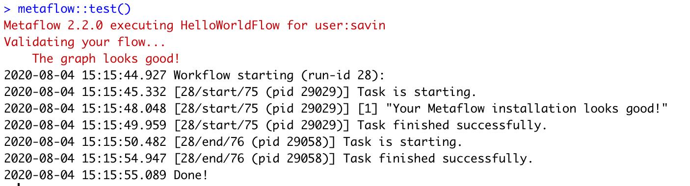

# Installing Metaflow

## MacOS/Linux

Metaflow is available as an R package for MacOS and Linux. You can get it from our [GitHub repository](https://github.com/Netflix/metaflow) \(or very soon from CRAN\):

```r
devtools::install_github("Netflix/metaflow", subdir="R")
```

You can finish the installation by typing - 

```bash
metaflow::install()
```


Metaflow requires **Python 3** in order to install the python package since Python 3 has fewer bugs and is better supported than [the deprecated Python 2.7](http://pythonclock.org). Metaflow R also relies on**`numpy`** and **`pandas`**to handle native R matrix and data.frame. The `metaflow::install()` would install **numpy** and **pandas** together with pythonic metaflow package.



If you're inside a conda environment or a Python virtual env, you may want to disable the `user` mode. See details in the [Troubleshooting](install.md#error-can-not-perform-a-user-install) section below on this topic.

```bash
metaflow::install(user=FALSE)
```


You can test your installation by running:

```bash
Sys.setenv("USERNAME" = 'mfuser')
metaflow::test()
```

If you see the message `Your Metaflow installation looks good!` congratulations! Now you can get started with Metaflow by following the [tutorial](tutorials/) or you can [jump straight into the docs](../metaflow/basics.md). 



Now you are ready to get your hands dirty with the [Tutorials](tutorials/).

## Windows Support

Metaflow currently doesn't offer native support for Windows. However, if you are using Windows 10, then you can use [WSL](https://docs.microsoft.com/en-us/windows/wsl/about) \(Windows Subsystem for Linux\) to install Metaflow. WSL lets you run a Linux environment inside Windows 10. 

Follow these instructions to get set up with WSL 2 - 

1. Update your Windows 10 distribution to version 2004 or higher.
2. Follow [these steps](https://docs.microsoft.com/en-us/windows/wsl/install-win10) to install WSL 2. When prompted, choose Ubuntu 18.04 as the Linux distribution.
3. Open Ubuntu 18.04 on your workstation, and run the following commands in the terminal to install R and Python - 

```r
sudo apt-key adv --keyserver keyserver.ubuntu.com --recv-keys E298A3A825C0D65DFD57CBB651716619E084DAB9
sudo echo "deb http://cran.wustl.edu/bin/linux/ubuntu bionic-cran35/" | sudo tee -a /etc/apt/sources.list
sudo apt update
sudo apt install r-base r-base-dev
sudo apt install libcurl4-openssl-dev libxml2-dev libssl-dev

sudo apt-get install python3 python3-pip
echo "alias python=python3; alias pip=pip3" > ~/.bash_aliases
source ~/.bash_aliases
python --version
pip --version
pip install numpy pandas --user
```

\[Optional\] To set up RStudio IDE - 

1. Inside Ubuntu 18.04 on Windows, run the following commands -

```r
sudo apt install -y r-base r-base-core r-recommended r-base-dev gdebi-core build-essential libcurl4-gnutls-dev libxml2-dev libssl-dev
wget https://rstudio.org/download/latest/stable/server/bionic/rstudio-server-latest-amd64.deb
sudo gdebi rstudio-server-latest-amd64.deb
sudo rstudio-server start
```

You can access RStudio at [http://localhost:8787](http://localhost:8787) in your browser in Windows.

To install Metaflow - 

1. Inside Ubuntu 18.04 on Windows, open the R console \(or your RStudio IDE installed in the previous step\) and run the following commands -

```r
install.packages('devtools', INSTALL_opts = c('--no-lock'))
devtools::install_github("netflix/metaflow", subdir = "R")
metaflow::install()

metaflow::test()
```

## Troubleshooting

### ERROR: Can not perform a '--user' install

You might see an error message `ERROR: Can not perform a '--user' install`when running `metaflow::install()`, when your Python interpreter is provisioned by a virtual environment. To unblock yourself, please install by disabling the \`user\` mode:

```r
metaflow::install(user=FALSE)
```

### Error: Python shared library not found

If you see an error message `Error: Python shared library not found` when running `metaflow::install()`, you can set up a [conda environment](https://docs.conda.io/en/latest/) via `reticulate` and continue your installation inside that conda environment. Here we create a conda environment - `metaflow-env` :

```r
reticulate::install_miniconda()
reticulate::use_miniconda()
reticulate::conda_create(envname = "metaflow-env", packages = "python")
reticulate::use_condaenv(condaenv="metaflow-env", required = T)
metaflow::install()
```

### ModuleNotFoundError: No module named 'metaflow'

If you see the error message `ModuleNotFoundError: No module named 'metaflow'` right after `metaflow::install()`, please restart your R session. If this does not help, try installing in a conda environment as mentioned in the previous subsection.

### Metaflow could not determine your user name based on environment variables

You need to set the `USERNAME` environment variable either in bash or in R before running `metaflow::test()`



```
export USERNAME=mfuser
Rscript -e "metaflow::test()"
```



```r
Sys.setenv("USERNAME" = 'mfuser')
metaflow::test()
```



