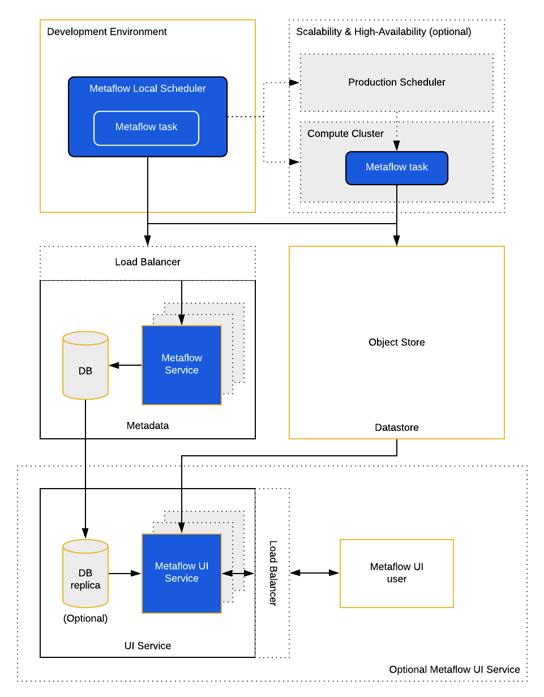
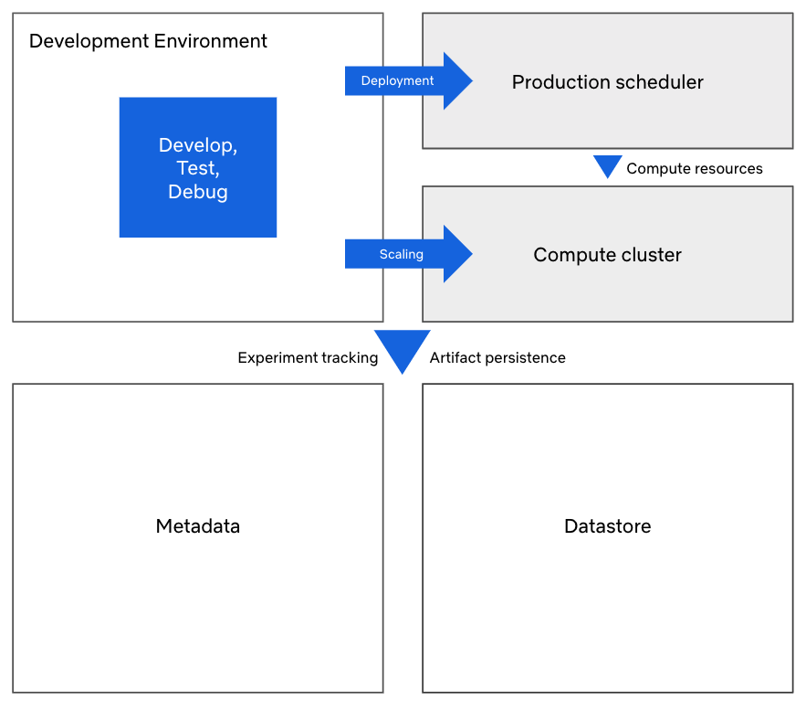

# Service Architecture

Metaflow can be used in _the local mode,_ e.g. on a laptop_,_ without any connection to the outside world. The local mode is the out-of-the-box default when you `pip install metaflow`. In this mode, all computation is performed locally as subprocesses and all data and metadata is persisted in a local directory.

To benefit from the centralized [experiment tracking and sharing via Client API](https://docs.metaflow.org/metaflow/client), [scalable computation](https://docs.metaflow.org/metaflow/scaling), [dependency management](https://docs.metaflow.org/metaflow/dependencies), and [production deployments](https://docs.metaflow.org/), we recommend that an administrator sets up infrastructure that allows Metaflow to be used in _the shared mode_.

The diagram below depicts the service architecture of the shared mode. The components outlined in yellow, development environment, datastore, and Metaflow service and its DB are required. The components outlined with dashed lines are optional.

Before we go into details about each of the components, the following diagram highlights **why** the components exist. Metaflow treats both prototyping and production as equally important activities, which is why both Development Environment and Production Scheduler are supported as first-class execution environments for Metaflow workflows. Both of these environments can rely on a separate Compute Cluster, typically a container platform, to provision compute resources on the fly. Much of the value of Metaflow relates to the fact that all executions are tracked by a central metadata service and their results are persisted in a common datastore.

## Required Services

At the minimum, you need to set up the following three services to leverage Metaflow in the shared mode.

### Development Environment

The client-side of Metaflow consists of a command-line tool, metaflow, and a Python package, also named metaflow. The user needs a development environment where they can develop and test their Metaflow workflows.

The development environment has the following requirements:

1. [Metaflow needs to be installed](https://docs.metaflow.org/getting-started/install). Note that there isn’t a strict requirement to use the latest version of the library.
2. Metaflow needs to be configured to access the provided services. The administrator can set up the configuration file once and use the `metaflow configure import` command to import the file, or copy it manually to `~/.metaflowconfig/config.json`. At the minimum, the configuration needs to include the metadata service URL and information related to the datastore.
3. The development environment needs to have the right cloud credentials to make API calls to the provided cloud services \(e.g. `~/.aws/credentials` or IAM instance profile needs to be set up\).

The user’s laptop can work as a development environment but we recommend providing a sandbox instance / container in the cloud, if possible. A cloud instance has multiple benefits:

* Network connectivity to the datastore has a much lower latency, a higher throughput, and less variance compared to a typical home or office wifi, which results in a better user experience.
* It is possible to provide large development instances for power users with lots of RAM, multiple CPU cores and optionally with GPUs. Metaflow will automatically use all the cores available to parallelize workflows, enabling faster iterations during development.
* The cloud instance can use the same operating system, Linux, as the compute cluster, which makes it more straightforward to use libraries with OS-specific dependencies.
* It is often easier to provide automatically refreshing authentication tokens on a cloud instance \(e.g. using an IAM instance profile on AWS\) compared to a laptop.

Note that many modern IDEs, e.g. [VSCode](https://code.visualstudio.com/docs/remote/remote-overview) or [PyCharm](https://www.jetbrains.com/help/pycharm/configuring-remote-interpreters-via-ssh.html), support code execution on a remote instance so the users can use a local editor to edit their code but execute it in the cloud.

### Metadata

[The Metaflow Service](https://github.com/Netflix/metaflow-service) tracks all details about Metaflow executions, including pointers to the artifacts in the datastore. The main consumer of the service is the [Client API](https://docs.metaflow.org/metaflow/client). Metaflow executions don’t read from the service internally, since they access the datastore directly.

No bulk data is stored in the service, so just a small instance backed by a medium-size database can keep track of millions of executions. As of today, we support Postgres as the backend database.

The service is provided as [a pre-baked Docker container](https://hub.docker.com/r/netflixoss/metaflow_metadata_service) which you can deploy to a microservice platform of your choice. The service is a simple Flask app communicating with the Metaflow library over HTTP, so you can deploy it like any other basic web application.

The service doesn’t have any built-in support for authentication. We assume that the service is typically deployed inside a private network that provides a secure operating environment.

Optionally, you can deploy multiple instances of the service behind a load balancer. The [AWS CloudFormation deployment path](http://google.com/) does this for you automatically.

#### Metadata Migrations

We recommend that you always deploy the latest version of the service image. The latest image is guaranteed to be compatible with all previous versions of the client. However, occasionally new features of Metaflow require the database schema to be changed, which will require manual action from the administrator.

To make the administrator’s life easy, the Metaflow Service comes with a built-in migration service. When you deploy or restart the latest version of the image, it will detect the schema version of the database, and launch a corresponding version of the service. It will not upgrade the database automatically.

If a new feature in the client requires a newer version of the service, a clear error message is shown about it. In this situation, the administrator should decide if and when they want to run the migration, which will incur some downtime - typically a few minutes. As a best practice, it is advisable to take a backup of the database prior to the migration.

The migration itself is just a matter of running a single command and restarting the service afterwards. How to do this exactly depends on your deployment strategy: See a separate section about [running migrations on AWS](http://google.com/).

### Datastore

While Metaflow uses local disk as a datastore in the local mode, fundamentally Metaflow is designed to use a cloud-based object store such as AWS S3 as a persistence layer. Object stores provide excellent scalability in terms of space, massive throughput for concurrent requests, high durability, and desirable cost-effectiveness, which means that Metaflow can afford storing all artifacts automatically without having to worry about overloading the storage backend. Internally, Metaflow uses the datastore as a [Content Addressable Storage](https://en.wikipedia.org/wiki/Content-addressable_storage), which means that no duplicate artifacts are stored.

In the administrator’s point of view, an object store like S3 is effectively maintenance-free. You may configure access policies and lifecycle rules for your object store as required by your organization.

## Optional Services

The following two services are optional. They provide a way to scale out Metaflow executions and deploy Metaflow workflows in a highly available production scheduler. If your organization doesn’t require elastic scalability and occasional downtime for scheduled workflow executions is acceptable, you may ignore these services.

### Compute Cluster

Similarly as a cloud-based object store provides a semblance of an infinitely scalable datastore, a cloud-based, elastically scalable compute cluster provides an infinitely scalable compute backend. Whereas HPC systems of the previous generation had to focus on careful management of limited resources, Metaflow takes more of a function-as-a-service approach: The user defines a function to be computed, a Metaflow task, optionally specifying resources it requires. The function can be executed locally in the Development Environment as a process or it can be shipped out to a compute cluster, which provisions resources for it on the fly.

The compute cluster can support two dimensions of scalability: Vertical scalability with a large instance with tens of CPU cores, multiple GPUs, and hundreds of GBs of RAM can be the most efficient way to train a large ML model, for instance. Horizontal scalability through [Metaflow’s foreach construct](https://docs.metaflow.org/metaflow/basics#foreach) can be an efficient way to handle e.g. sharded datasets in an embarrassingly parallel fashion. The user can choose any combination of the two dimensions which best serves their workload.

Currently, Metaflow provides an integration to AWS Batch as a Compute Cluster backend. The administrator can configure compute environments in Batch depending on the types of workloads that they want to support in Metaflow.

### **Production Scheduler**

Metaflow comes with a built-in local scheduler which makes it easy to develop and test workflows in the Development Environment. It is a great solution for use cases where quick, manual iterations are preferred over high availability and unattended execution.

Data science workflows that need to run automatically without any human intervention have a different set of requirements. Most importantly, the scheduler needs to be highly available, i.e. it needs to be backed by a cluster of instances so that a failure of any single instance won’t interrupt the scheduler. Preferably it would need to be highly scalable as well, both in terms of the size of a single workflow as well as the number of concurrent workflows, which can grow to hundreds of thousands in a large deployment like at Netflix. In addition, the scheduler should provide flexible ways to trigger executions, and it should provide a plethora of tools for operational monitoring and alerting.

The user can deploy their Metaflow workflow to the production scheduler with a single command - no changes in the code are required. We recognize that “deploying to production” is not a linear process. Rather, we expect the user to use both the local scheduler and the production scheduler in parallel. For instance, after the initial deployment, the data scientist typically wants to continue working on the project locally. Eventually, they might want to deploy a new, experimental version on the production scheduler to run in parallel with the production version as an A/B test. Also, things fail in production. Metaflow allows the user to reproduce issues that occur on the production scheduler locally, simply by using [the resume command](https://docs.metaflow.org/metaflow/debugging#how-to-use-the-resume-command) to continue the execution on their local machine.

Currently, Metaflow supports [AWS Step Functions as the Production Scheduler](http://google.com). For more background about production schedulers, see [the release blog post for Step Functions integration](http://google.com).  

