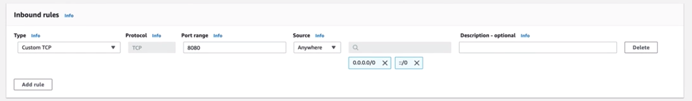

# Deploying to AWS

Metaflow comes bundled with [first class support for various services on AWS](metaflow-on-aws.md#amazon-web-services). This guide gives a walk-through of how to configure Metaflow in your own AWS account. 

To get Metaflow up and running in your AWS account, configuration needs to be instrumented for :

| Service | AWS |
| :--- | :--- |
| **Datastore** | [S3](https://aws.amazon.com/s3/) |
| **Compute** | [Batch](https://aws.amazon.com/batch/) |
| **Metadata** | [Metaflow Metadata Service](https://github.com/Netflix/metaflow-service) / [RDS](https://aws.amazon.com/rds/) |

You can mix and match these services, Metaflow places no requirements that all of these be stood up. Currently, the only limitation Metaflow places is that S3 as Datastore be configured if you intend to use AWS Batch as your Compute service. The following sections walk you through how to stand up these services and configure Metaflow to use them as well as a [CloudFormation template](deploy-to-aws.md#cloudformation-template) to automate this process:

## Datastore: S3

Metaflow stores all data artifacts, code packages and library dependencies in [S3](https://docs.aws.amazon.com/AmazonS3/latest/dev/Welcome.html). Minimally, you need to [create at least one S3 bucket](https://docs.aws.amazon.com/AmazonS3/latest/gsg/CreatingABucket.html) to store these objects. 

### [Configuration parameters](https://github.com/Netflix/metaflow/blob/master/metaflow/metaflow_config.py)

#### `METAFLOW_DATASTORE_SYSROOT_S3` \[Required\]

S3 bucket and prefix used by Metaflow to store data artifacts and code packages.

#### `METAFLOW_DATATOOLS_S3ROOT` \[Optional\]

S3 bucket and prefix used by metaflow.S3 to store data objects. Defaults to `$METAFLOW_DATASTORE_SYSROOT_S3/data`.

#### `METAFLOW_CONDA_PACKAGE_S3ROOT` \[Optional\]

S3 bucket and prefix used by Metaflow to store conda packages. Defaults to `$METAFLOW_DATASTORE_SYSROOT_S3/conda`.

#### `METAFLOW_S3_ENDPOINT_URL` \[Optional\]

Allows you to specify the `endpoint_url` parameter for Boto \(see [here](https://boto3.amazonaws.com/v1/documentation/api/latest/reference/core/session.html#boto3.session.Session.client)\).

## Compute: Batch

To orchestrate compute on [Batch](https://docs.aws.amazon.com/batch/latest/userguide/what-is-batch.html), you need to minimally create [a Compute Environment](https://docs.aws.amazon.com/batch/latest/userguide/create-compute-environment.html), [a Job Queue](https://docs.aws.amazon.com/batch/latest/userguide/create-job-queue.html) and [an IAM role](https://docs.aws.amazon.com/AmazonECS/latest/developerguide/task-iam-roles.html#create_task_iam_policy_and_role) that allows the Batch container to access [your S3 bucket](deploy-to-aws.md#datastore-s3) \(`ListBucket`, `PutObject`, `GetObject`, `DeleteObject`\) as well as any other AWS services your user code might interface with \(e.g, allowing `PassRole` privileges to sagemaker services\).

### [Configuration parameters](https://github.com/Netflix/metaflow/blob/master/metaflow/metaflow_config.py)

#### `METAFLOW_BATCH_JOB_QUEUE` \[Required\]

Batch job queue for Metaflow to place jobs on.

#### `METAFLOW_ECS_S3_ACCESS_IAM_ROLE` \[Required\]

IAM role allowing Batch ECS tasks to access S3 and other AWS services.

#### `METAFLOW_BATCH_CONTAINER_IMAGE` \[Optional\]

Default Docker container image to execute Batch tasks on. Defaults to [Python image](https://hub.docker.com/_/python/) corresponding to the `major.minor` version of the Python interpreter running the flow.

#### `METAFLOW_BATCH_CONTAINER_REGISTRY` \[Optional\]

Default Docker container registry to pull container images from. Defaults to [docker hub](https://hub.docker.com/).

## Metadata: Metaflow Service

The [metaflow service](http://github.com/netflix/metaflow-service) is a simple [aiohttp](https://aiohttp.readthedocs.io/en/stable/) service on top of an RDS instance. To set it up, follow these steps:

### Create VPC


### Create Security Groups

Select EC2 from services

Navigate to Security Groups from left pane


Select vpc that was created in the previous step from drop down

**Create ECS Security Group**

This security group will allow inbound api access to metadata service

Add rule to make port 8080 accessible



Record ecs security group id for use in next step

**Create RDS security group**

Create another security group within same vpc. This group will be used to allow postgres access from ECS \(i.e. allow the metadata service to read from the DB\)

Add rule to make port 5432 accessible \(type postgres\) and attach to ECS security group


### Create RDS

Note: Currently we only support Postgres as the backend DB


under "Additional connectivity configuration" add the security group that was previously created \(ECS -&gt; 5432\)


Finally under "Additional Configuration" at the bottom of the page. Configure the initial database name. By default the Metadata Service expects the db name to be "metaflow". Although this is configurable via environment variables.


### Create ECS Service Cluster


### Set up ECS Task Definition


### Create Metaflow Service


Note: Be sure to select security group created in previous step \([0.0.0.0/0](http://0.0.0.0/0) -&gt; 8080\)


### [Configuration parameters](https://github.com/Netflix/metaflow/blob/master/metaflow/metaflow_config.py)

#### `METAFLOW_SERVICE_URL` \[Required\]

URL to the Metaflow service.

## CloudFormation Template

We understand that setting up these services manually and getting all the permissions right can be complicated at times; that is why we bundle in a [CloudFormation template](https://github.com/Netflix/metaflow-tools/tree/master/aws/cloudformation) to automate setting up these services on AWS. This template can be used both within [CloudFormation](https://aws.amazon.com/cloudformation/) as well as [ServiceCatalog](https://aws.amazon.com/servicecatalog/) for provisioning resources.

## Configuring Metaflow

Metaflow can be configured via CLI :

```bash
metaflow configure aws
```

Additionally, any of the specified configuration parameters can be overridden by specifying them as environment variables.

