# Manual Deployment

There are many ways \(automated and manual\) to deploy, configure, and manage AWS resources depending on your security posture and familiarity with the AWS eco-system. If you cannot use [our AWS CloudFormation template](aws-cloudformation-deployment.md), this article lists the steps for a rather straightforward deployment of AWS resources for use by Metaflow. 

Please note that Metaflow can re-use existing AWS resources - for example, your existing AWS Batch job queue for job execution. The instructions listed here will create these resources from scratch. If you have a strong background in administering AWS resources, you will notice that many of the security policies are fairly permissive and are intended to serve as a starting point for more complex deployments. [Please reach out to us](../../overview/getting-in-touch.md) if you would like to discuss more involved deployments.

## Steps for Manual Deployment

These steps assume that the users of Metaflow have sufficient AWS credentials on their workstation to interact with the AWS resources that are spun up.

### Datastore

Metaflow currently supports [Amazon S3](https://aws.amazon.com/s3/) as the storage backend for all the data that is generated during the execution of Metaflow flows. 

Metaflow stores all flow execution data \(user code, pickled object files, etc.\) in an S3 folder which is set as the variable `METAFLOW_DATASTORE_SYSROOT_S3` in the metaflow configuration. In case, you are using [metaflow.S3](https://docs.metaflow.org/metaflow/data#data-in-s-3-metaflow-s3), you can set the variable `METAFLOW_DATATOOLS_S3ROOT` to store your data in a specific folder in S3.

#### Create a private Amazon S3 bucket 

The following instructions will create a private S3 bucket for Metaflow -

1. Sign in to the AWS Management Console and open the [Amazon S3 console](https://console.aws.amazon.com/s3/).
2. Choose _Create bucket_.
3. In _Bucket name_, enter a DNS-compliant name for your bucket. Avoid including sensitive information, such as account numbers, in the bucket name. The bucket name is visible in the URLs that point to the objects in the bucket.
4. In _Region_, choose the AWS Region where you want the bucket to reside. Choose a Region close to you to minimize latency and costs.
5. In _Bucket settings for Block Public Access_, keep the values set to the defaults. By default Amazon S3 blocks all public access to your buckets. 
6. Choose _Create bucket_.

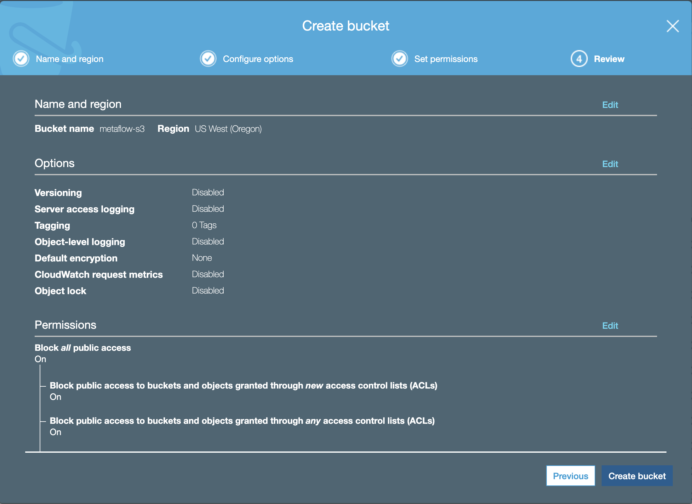

In this example, we created a private bucket `metaflow-s3`. While configuring Metaflow through `metaflow configure aws`, we can set the following values when prompted -

```python
METAFLOW_DATASTORE_SYSROOT_S3 = s3://metaflow-s3/flows
METAFLOW_DATATOOLS_SYSROOT_S3 = s3://metaflow-s3/data-tools
METAFLOW_DEFAULT_DATASTORE=s3
```

### Compute

Metaflow currently supports [scaling compute](https://docs.metaflow.org/metaflow/scaling) via [AWS Batch](https://aws.amazon.com/batch/). Metaflow orchestrates this compute by leveraging Amazon S3 as the storage layer for code artifacts. If you want to use AWS Batch, you would have to configure Amazon S3 first following the instructions listed [previously](manual-deployment.md#storage).

Once you have set up your Amazon S3 bucket, you would need to set up an AWS Batch job queue and an IAM role that has permission to access Amazon S3 \(and other AWS services\). Jobs launched via Metaflow on AWS Batch will assume this role so that they can communicate with Amazon S3.

Before you can create a [job queue](https://docs.aws.amazon.com/batch/latest/userguide/job_queues.html), you would need to set up a [compute environment](https://docs.aws.amazon.com/batch/latest/userguide/compute_environments.html) that your job queue will eventually execute jobs on. There are many ways to create a compute environment depending on your specific use case. In most cases, a managed compute environment is sufficient, where AWS manages your compute resources with sensible defaults. But, if you prefer, you can create an unmanaged compute environment by following [these instructions from AWS](https://docs.aws.amazon.com/batch/latest/userguide/create-compute-environment.html). If you want to know how to create a managed compute environment, read on!

Compute resources in your compute environments need external network access to communicate with the Amazon ECS service endpoint. However, you might have jobs that you would like to run in private subnets. Creating a VPC with both public and private subnets provides you the flexibility to run jobs in either a public or private subnet. Jobs in the private subnets can access the internet through a NAT gateway. Before creating an AWS Batch compute environment, we would need to create a VPC with both public and private subnets.

#### Create a VPC

1. Run the VPC Wizard
   1. Open the [Amazon VPC console](https://console.aws.amazon.com/vpc/) and in the left navigation pane, choose _VPC Dashboard_.
   2. Choose _Launch VPC Wizard, VPC with a Single Public Subnet, Select._
   3. For _VPC name_, give your VPC a unique name.
   4. For _Elastic IP Allocation ID_, choose the ID of the Elastic IP address that you created earlier.
   5. Choose _Create VPC_.
   6. When the wizard is finished, choose _OK_. Note the Availability Zone in which your VPC subnets were created. Your additional subnets should be created in a different Availability Zone. These subnets are not auto-assigned public IPv4 addresses. Instances launched in the public subnet must be assigned a public IPv4 address to communicate with the Amazon ECS service endpoint.
2. Create Additional Subnets

   The wizard in Step 2. creates a VPC with a single public in a single Availability Zone. For greater availability, you should create at least one more subnet in a different Availability Zone so that your VPC has public subnets across two Availability Zones. To create an additional public subnet

   1. In the left navigation pane, choose _Subnets_ and then _Create Subnet_.
   2. For _Name tag_, enter a name for your subnet, such as _Public subnet_.
   3. For _VPC_, choose the VPC that you created earlier.
   4. For _Availability Zone_, choose the same Availability Zone as the additional private subnet that you created in the previous procedure.
   5. For _IPv4 CIDR block_, enter a valid CIDR block. For example, the wizard creates CIDR blocks in 10.0.0.0/24 and 10.0.1.0/24 by default. You could use 10.0.2.0/24 for your second public subnet.
   6. Choose _Yes, Create_.
   7. Select the public subnet that you just created and choose _Route Table, Edit._
   8. By default, the private route table is selected. Choose the other available route table so that the _0.0.0.0/0_ destination is routed to the internet gateway \(_igw-xxxxxxxx_\) and choose _Save_.
   9. With your second public subnet still selected, choose _Subnet Actions, Modify auto-assign IP settings_.
   10. Select _Enable auto-assign public IPv4 address_ and choose _Save, Close_.

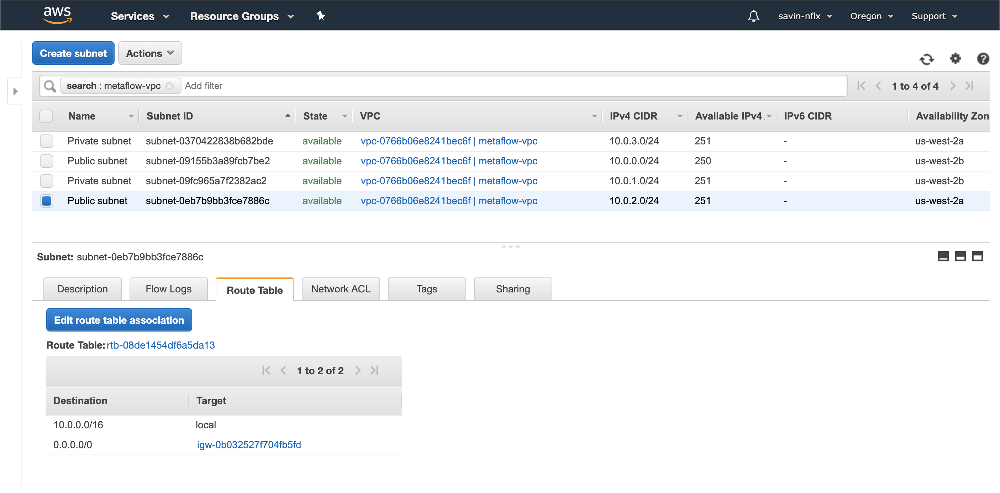

#### Create a managed AWS Batch compute environment

1. Open the [AWS Batch console](https://console.aws.amazon.com/batch/) and from the navigation bar, select the region to use.
2. In the navigation pane, choose _Compute environments, Create environment_.
3. Configure the environment.
   1. For _Compute environment type_, choose _Managed_.
   2. For _Compute environment name_, specify a unique name for your compute environment.
   3. For _Service role_, choose to have AWS create a new role for you.
   4. For _Instance role_, choose to have AWS create a new instance profile for you.
   5. For _EC2 key pair_ leave it empty.
   6. Ensure that _Enable compute environment_ is selected so that your compute environment can accept jobs from the AWS Batch job scheduler.
4. Configure your compute resources.
   1. For _Provisioning model_, choose _On-Demand_ to launch Amazon EC2 On-Demand Instances or _Spot_ to use Amazon EC2 Spot Instances.
   2. If you chose to use Spot Instances:
      1. \(Optional\) For _Maximum Price_, choose the maximum percentage that a Spot Instance price can be when compared with the On-Demand price for that instance type before instances are launched.
      2. For _Spot fleet role_, choose an existing [Amazon EC2 Spot Fleet IAM role](https://docs.aws.amazon.com/batch/latest/userguide/spot_fleet_IAM_role.html) to apply to your Spot compute environment.
   3. For _Allowed instance types_, choose the Amazon EC2 instance types that may be launched. You can specify instance families to launch any instance type within those families \(for example, c5, c5n, or p3\), or you can specify specific sizes within a family \(such as c5.8xlarge\).  You can also choose _optimal_ to pick instance types \(from the C, M, and R instance families\) on the fly that match the demand of your job queues. In order to use GPU scheduling, the compute environment must include instance types from the P or G families.
   4. For _Allocation strategy_, choose the allocation strategy to use when selecting instance types from the list of allowed instance types. For more information, see [Allocation Strategies](https://docs.aws.amazon.com/batch/latest/userguide/allocation-strategies.html).
   5. For _Minimum vCPUs_, choose the minimum number of EC2 vCPUs that your compute environment should maintain, regardless of job queue demand.
   6. For _Desired vCPUs_, choose the number of EC2 vCPUs that your compute environment should launch with.
   7. For _Maximum vCPUs_, choose the maximum number of EC2 vCPUs that your compute environment can scale out to, regardless of job queue demand.
   8. \(Optional\) Check _Enable user-specified AMI ID_ to use your own custom AMI. For more information on custom AMIs, see [Compute Resource AMIs](https://docs.aws.amazon.com/batch/latest/userguide/compute_resource_AMIs.html).
      1. For _AMI ID_, paste your custom AMI ID and choose _Validate AMI_.
5. Configure networking.
   1. For _VPC ID_, choose the VPC which you created [earlier](manual-deployment.md#create-a-vpc).
   2. For _Subnets_, choose which subnets in the selected VPC should host your instances. By default, all subnets within the selected VPC are chosen.
   3. For _Security groups_, choose a security group to attach to your instances. By default, the default security group for your VPC is chosen.
6. \(Optional\) Tag your instances so that it is helpful for recognizing your AWS Batch instances in the Amazon EC2 console.
7. Choose _Create_ to finish.

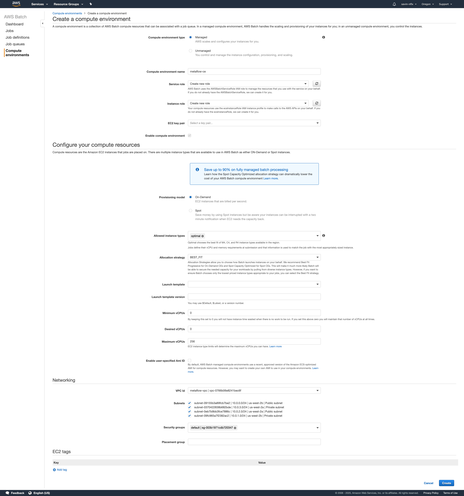

#### **Create an AWS Batch job queue**

1. Open the [AWS Batch console](https://console.aws.amazon.com/batch/) and select the region to use.
2. In the navigation pane, choose _Job queues, Create queue_.
3. For _Queue name_, enter a unique name for your job queue.
4. Ensure that _Enable job queue_ is selected so that your job queue can accept job submissions.
5. For _Priority_, enter an integer value for the job queue's priority. Job queues with a higher integer value are evaluated first when associated with the same compute environment.
6. In the _Connected compute environments for this queue_ section, select the [compute environment](manual-deployment.md#create-a-managed-aws-batch-compute-environment) that you just created.
7. Choose _Create_ to finish and create your job queue.

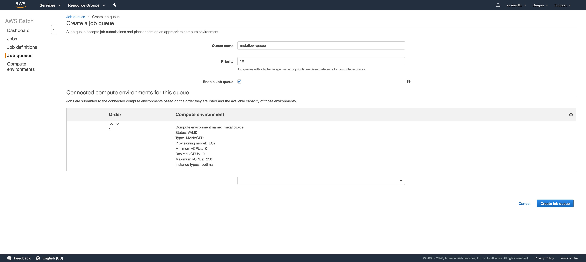

In this example, we create an AWS Batch job queue `metaflow-queue` following the steps listed above.

#### Create an IAM role for AWS Batch

1. Open the [IAM console](https://console.aws.amazon.com/iam/) and in the navigation pane, choose _Roles, Create role_.
2. For _Select type of trusted entity_ section, choose _AWS service_.
3. For _Choose the service that will use this role_, choose _Elastic Container Service_.
4. For _Select your use case_, choose _Elastic Container Service Task_ and choose _Next: Permissions_.
5. Next, we will create a policy for Amazon S3 and attach it to this role
   1. Amazon S3 for data storage
      1. Choose _Create Policy_ to open a new window.
      2. Use the visual service editor to create the policy
         1. For _Service_, choose _S3._
         2. For _Actions,_ add _GetObject, PutObject, DeleteObject_ and _List Bucket_ as allowed actions
         3. For _resources,_ for _bucket_ put in the bucket name create [earlier](manual-deployment.md#create-a-private-amazon-s3-bucket). For _object,_ use the same bucket name and choose any for _object name_. Choose _Save changes._
         4. Choose _Review policy._ On the _Review policy_ page, for _Name_ type your own unique name and choose _Create policy_ to finish.
   2. Amazon DynamoDB - Metaflow uses a DynamoDB table to track execution information for certain steps within AWS Step Functions. If you intend to use AWS Step Functions, you would need to create a policy for Amazon Dynamo DB as well.
      1. In the original pane \(in Step 4.\), Choose _Create Policy_ to open a new window.
      2. Use the visual service editor to create the policy
         1. For _Service_, choose _DynamoDB._
         2. For _Actions,_ add _PutItem, GetItem, DeleteObject_ and _UpdateItem_ as allowed actions
         3. For _resources,_ for _region_ put in the region in which you will create your AWS Dynamo DB table and for _table name,_ use a table name \(that you will create later while configuring AWS Step Functions\). Choose _Save changes._
         4. Choose _Review policy._ On the _Review policy_ page, for _Name_ type your own unique name and choose _Create policy_ to finish.
6. Click the _refresh_ button in the original pane \(in Step 4.\) and choose the policies that you just created \(in Step 5.\). Choose _Next:tags._
7. For _Add tags \(optional\)_, enter any metadata tags you want to associate with the IAM role, and then choose _Next: Review_.
8. For _Role name_, enter a name for your role and then choose _Create role_ to finish. Note the ARN of the IAM role you just created.


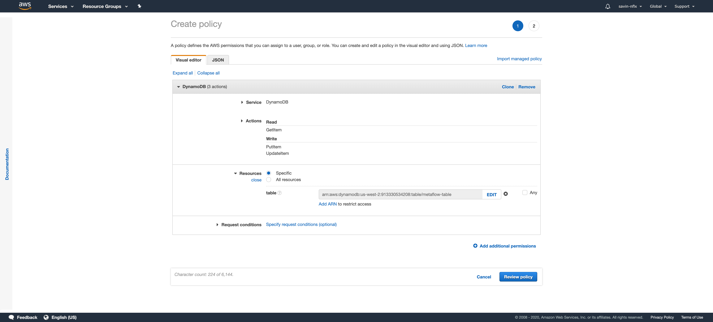

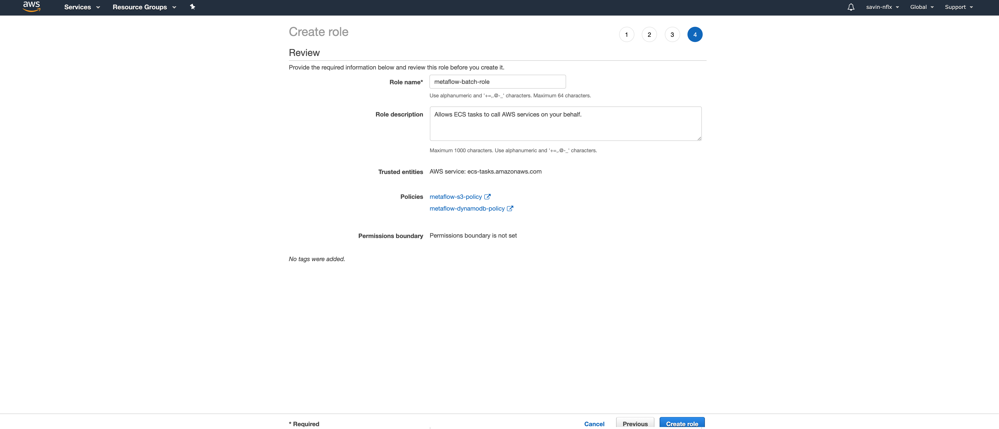

In this example, we created an AWS Batch job queue `metaflow-queue` and an IAM role `metaflow-batch-role`. While configuring Metaflow through `metaflow configure aws`, we can set the following values when prompted:

```text
METAFLOW_BATCH_JOB_QUEUE = metaflow-queue
METAFLOW_ECS_S3_ACCESS_IAM_ROLE = arn:aws:iam::xxxxxxxxxx:role/metaflow-batch-role
METAFLOW_DEFAULT_METADATA=service
```

Metaflow allows setting up some additional defaults for the docker image that AWS Batch jobs execute on. By default, an appropriate Python image \(matching the minor version of Python interpreter used to launch the flow\) is pulled from docker hub. You can modify the behavior by either pointing to a specific image or a specific docker image repository using the following variables:

```text
METAFLOW_BATCH_CONTAINER_REGISTRY = foo
METAFLOW_BATCH_CONTAINER_IMAGE = bar
```

### Metadata

Metaflow ships with a [metaflow service](https://github.com/Netflix/metaflow-service) that tracks all flow executions. This service is an aiohttp service with a SQL datastore as a backend. At a high level, this service can be thought of as an index on top of all the data that Metaflow stores in its datastore. This allows users to easily share their results and collaborate with their peers. Deploying this service is not strictly necessary, you can still use Amazon S3 as your storage backend and execute your flows on AWS Batch without it. But for any production deployment, we highly recommend deploying the metaflow service since it helps in easily monitoring the state of the Metaflow universe.

The Metadata service is available as a docker image in [docker hub](https://hub.docker.com/repository/docker/netflixoss/metaflow_metadata_service). There are many ways to deploy this service within AWS. Here we detail some of the steps to deploy this service on AWS Fargate with a PostgreSQL database in Amazon RDS.

#### Create a VPC

We will deploy the service within a VPC. You can use the same VPC that we created for AWS Batch [earlier](manual-deployment.md#create-a-vpc) or if you don't intend to use AWS Batch, you can create a VPC following [the same set of steps.](manual-deployment.md#create-a-vpc)

#### Create Security Groups

We will create two security groups, one for the AWS Fargate cluster and another for the AWS RDS instance.

1. Open the [EC2 console](https://console.aws.amazon.com/ec2/) and from the navigation bar, select the region to use.
2. Choose _Security Groups_ under _Resources._
3. You will notice that a security group already exists for the VPC that you created [previously](manual-deployment.md#create-a-vpc-1). Choose _Create security group_ to create a security group for the AWS Fargate cluster that we will create shortly.
4. Pick a name for your security group for _Security group name,_ add a _Description_ and select the VPC that you created [previously](manual-deployment.md#create-a-vpc-1) under _VPC._
5. For _Inbound rules_, 
   1. Select _Custom TCP_ for _Type._
   2. Use _8080_ for _Port range._
   3. Select _Anywhere_ for _Source type._
   4. Choose _Add rule_ and select _Custom TCP_ for _Type._
   5. Use _8082_ for _Port range._ This is needed for the migration service to work.
   6. Select _Anywhere_ for _Source type._
6. For _Outbound rules,_
   1. Select _All traffic_ for _Type_.
   2. Select _Custom_ for _Destination type_.
   3. Select _0.0.0.0/0_ for _Destination_.
7. Choose _Create security group._
8. Take note of the ID of the security group.
9. Next, we will create a security group for the AWS RDS instance. Choose _Copy to new security group_.
10. Pick a name for your security group for _Security group name_ and __add a _Description._ The correct _VPC_ is already selected for you.
11. For _Inbound rules_, instead of _Custom TCP_ for _Type_, choose _PostgreSQL_ and under _Source_, choose the security group from Step 8.
12. Choose _Create security group_ and take note of the ID.

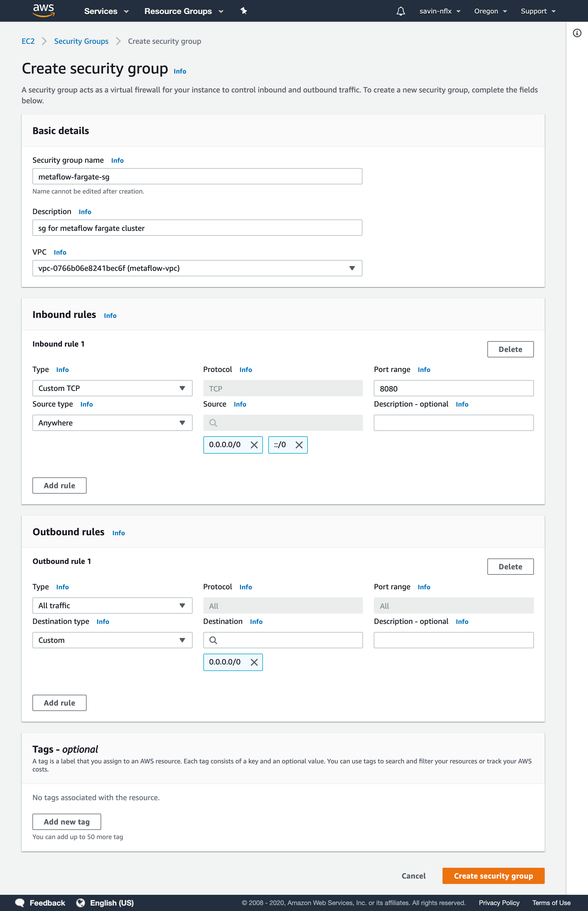

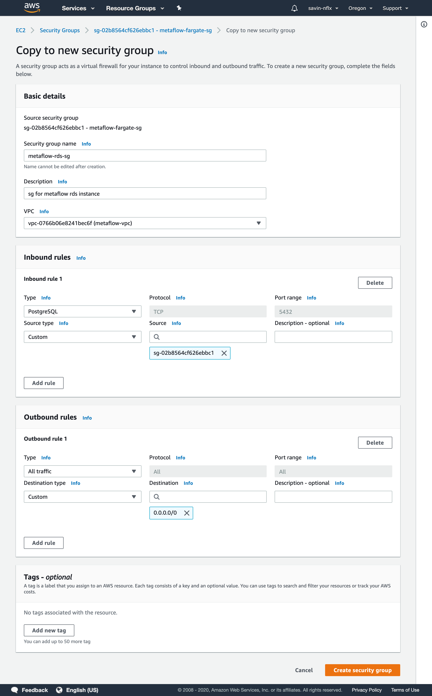

#### Create an AWS RDS instance

1. Open the [RDS console](https://console.aws.amazon.com/rds) and from the navigation bar, select the region to use.
2. Choose _Subnet Groups_ under _Resources._
3. Choose _Create DB Subnet Group_ to create a DB Subnet Group for your RDS instance within the VPC that you created [earlier](manual-deployment.md#create-a-vpc-1).
4. Pick a name for your subnet group for _Name_, add a _Description_ and select the VPC that you created [previously](manual-deployment.md#create-a-vpc-1) under _VPC._
5. Choose _Add all the subnets related to this VPC_ under _Add subnets_.
6. Choose _Create_.
7. Choose _Databases_ on the left side pane and then choose _Create database._
   1. Choose _Standard Create_ in _Choose a database creation method._
   2. In _Engine options,_ choose _PostgreSQL_ for _Engine type._ Leave the _Version_ untouched.
   3. In _Templates_, choose _Production._
   4. In _Settings_,
      1. Pick a unique name for _DB instance identifier_.
      2. Under _Credentials Settings,_
         1. Pick a _Master username._
         2. Pick a _Master password_ and use the same in _Confirm password._
   5. In _DB instance size,_ pick the instance you are most comfortable with. _Burstable classes_ are a good option.
   6. In _Storage_, 
      1. Under _Storage type,_ choose _General Purpose \(SSD\)._
      2. Allocate initial storage in _Allocated storage._ 100GiB is a good start.
      3. Check the _Enable storage autoscaling_ is enabled. This will allow your instance to scale up when it runs out of storage.
      4. Choose maximum storage for _Maximum storage threshold_. Your instance will scale up to a maximum of this limit. 1000GiB is a good number to begin with.
   7. In _Availability & durability,_ ensure that _Create a standby instance_ is enabled.
   8. In _Connectivity,_
      1. In _Virtual private cloud \(VPC\),_ choose the VPC that you created [previously](manual-deployment.md#create-a-vpc-1).
      2. In _Additional connectivity configuration_
         1. For _Subnet group_, choose the subnet group you created in Step 6.
         2. Select _No_ under _Publicly accessible_.
         3. Under _VPC security group_, choose _Choose existing_ and add both the security groups that you created [previously](manual-deployment.md#create-security-groups) in addition to the default security group.
         4. Choose _5432_ as the _Database port._
   9. In _Database authentication,_ enable _Password authentication._
   10. In _Additional configuration,_
       1. Under _Database options,_
          1. Set _metaflow_ as _Initial database name._
          2. Select _default.postgres11_ as the _DB parameter group_.
       2. Under _Backup,_
          1. Enable _Enable automatic backups_
          2. Choose a _Backup retention period_
          3. Choose a _Backup window_ if you so wish, otherwise check _No preference._
          4. Check _Copy tags to snapshots._
       3. Under _Performance Insights,_ if you so wish, enable _Enable Performance Insights._
       4. Under _Retention Period,_
          1. Choose a _Retention period_.
          2. Leave the _Master key_ to _default._  
       5. Under _Monitoring,_
          1. Choose _60 seconds_ for _Granularity._
          2. Set _default_ for the _Monitoring Role._
       6. Under _Log exports,_ you can choose to export either of the _Postgresql log_ or the _Upgrade log_.
       7. Under _Maintenance,_ choose _Enable auto minor version upgrade_ if you so wish to.
       8. Under _Deletion protection,_ enable _Enable deletion protection._
   11. Choose _Create database._
   12. Once the database spins up, note the _Endpoint & port_ under _Connectivity & security._

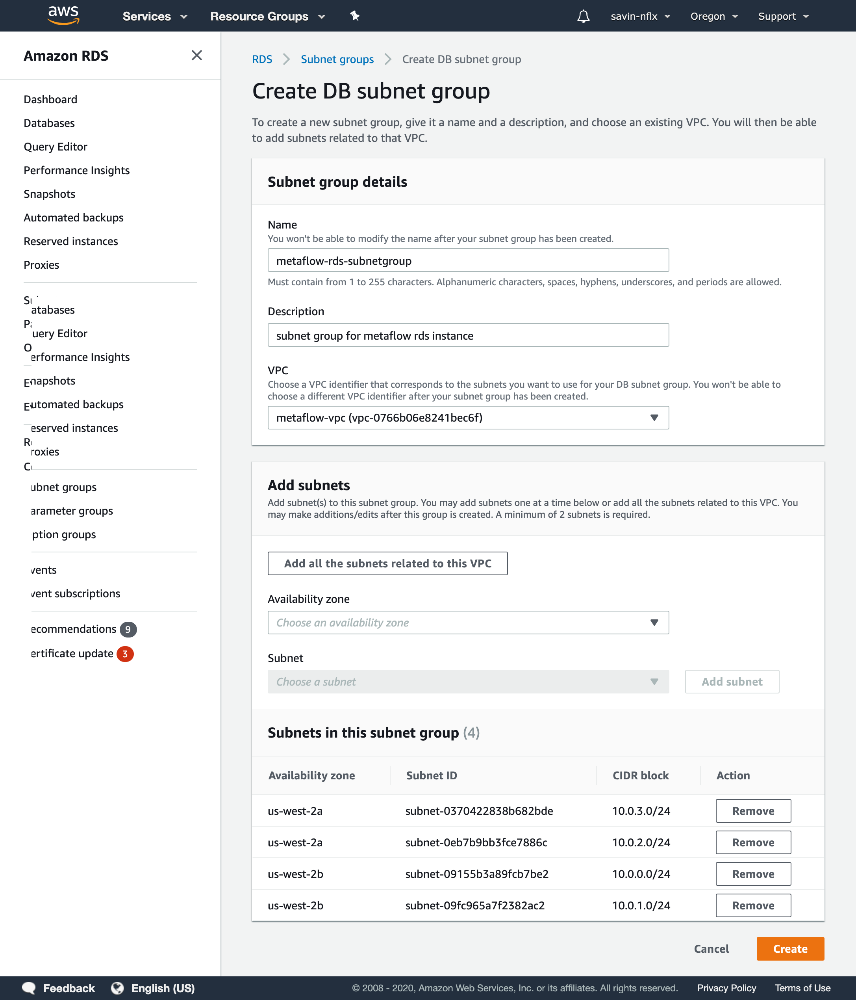

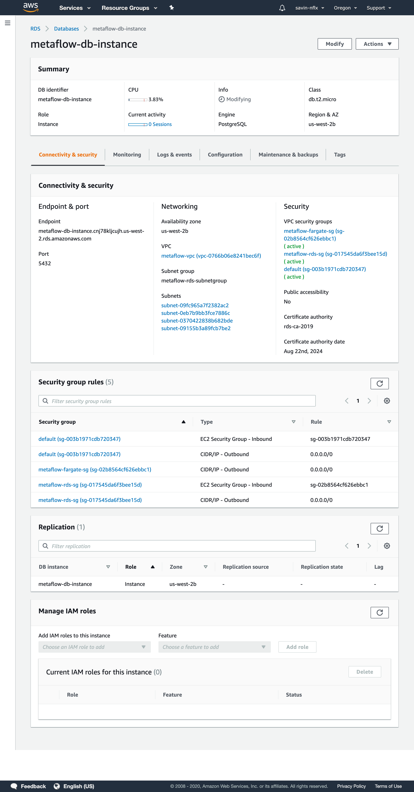

#### Create an IAM role for ECS Fargate Service

1. Open the [IAM console](https://console.aws.amazon.com/iam/) and in the navigation pane, choose _Roles, Create role_.
2. For _Select type of trusted entity_ section, choose _AWS service_.
3. For _Choose the service that will use this role_, choose _Elastic Container Service_.
4. For _Select your use case_, choose _Elastic Container Service Task_ and choose _Next: Permissions_.
5. Choose _AmazonECSTaskExecutionRolePolicy._
6. Choose _Next:tags._
7. For _Add tags \(optional\)_, enter any metadata tags you want to associate with the IAM role, and then choose _Next: Review_.
8. For _Role name_, enter a name for your role and then choose _Create role_ to finish. Note the ARN of the IAM role you just created.

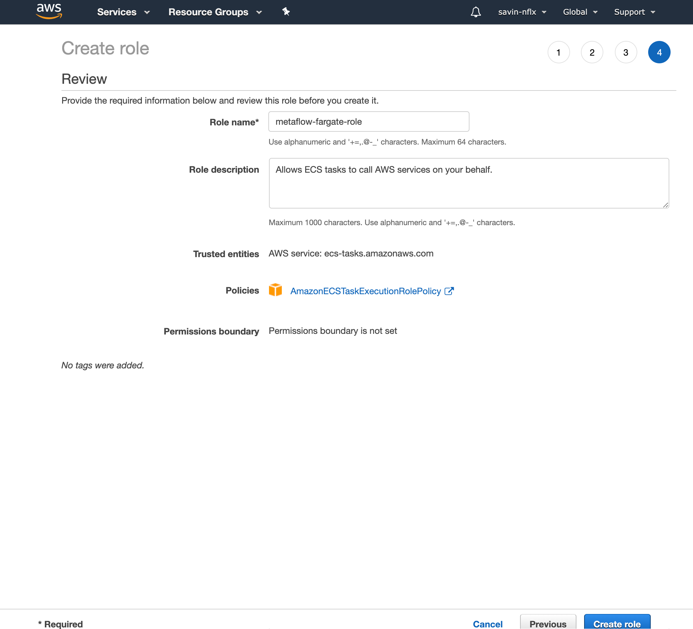

#### Create an AWS Fargate Cluster

1. Open the [ECS console](https://console.aws.amazon.com/ecs) and from the navigation bar, select the region to use.
2. Choose _Create Cluster_ under _Clusters._
3. Choose _Networking only, Next step._
4. Pick a name for _Cluster name._ Don't enable _Create VPC._ We will use the VPC we have created previously. You can choose to check _Enable Container Insights_. Choose _Create._
5. Choose _View Cluster_ and choose _Task Definitions_ on the left side pane.
6. Choose _Create new Task Definition_, _Fargate_ and _Next step_.
   1. Under _Configure task and container definitions,_
      1. Choose a _Task Definition Name_.
      2. Choose the _Task Role_ as the one [you just created above](manual-deployment.md#create-an-iam-role-for-ecs-fargate-service)_._
   2. Under _Task execution IAM role,_ set the _Task execution role_ to _ecsTaskExecutionRole_ if you have it already. Leave it empty otherwise.
   3. Under _Task size,_
      1. Choose 4 _GB_ for _Task memory \(GB\)_
      2. Choose 1 _vCPU_ for _Task CPU \(vCPU\)._
   4. Under _Container Definitions_, choose _Add container_
      1. Set _metaflow-service_ as the _Container name._
      2. Set _netflixoss/metaflow\_metadata\_service_ as the _Image._
      3. Leave other options as is.
      4. Under _Advanced container configuration,_ in _Environment variables_ add the following values
         1. Set _Key_ as _MF\_METADATA\_DB\_HOST_ and the _Value_ as the endpoint value in Step 12. while [creating the AWS RDS instance](manual-deployment.md#create-an-aws-rds-instance).
         2. Set _Key_ as _MF\_METADATA\_DB\_NAME_ and the _Value_ as _metaflow._
         3. Set _Key_ as _MF\_METADATA\_DB\__PORT __and the _Value_ as _5432._
         4. Set _Key_ as _MF\_METADATA\_DB\_USER_ and the _Value_ as the user from Step 7.4.2.1_._ while [creating the AWS RDS instance](manual-deployment.md#create-an-aws-rds-instance).
         5. Set _Key_ as _MF\_METADATA\_DB\_PSWD_ and the _Value_ as the user from Step 7.4.2.2_._ while [creating the AWS RDS instance](manual-deployment.md#create-an-aws-rds-instance).
      5. Choose _Add._
   5. Choose _Create._
7. Choose _Clusters_ in the left side pane and select the cluster you created in Step 4.
8. Choose _Create_ under _Services,_
   1. Choose _Fargate_ as _Lauch type._
   2. Choose the task definition that you created in Step 6. for _Task Definition._ Pick the latest for _Revision._
   3. For _Platform version_ choose _Latest._
   4. Leave the _Cluster_ as is \(pointing to the cluster that you are configuring\).
   5. Pick a name for _Service name._
   6. Pick a number for _Number of tasks._ In this example we will use 1.
   7. Choose _Rolling update_ for _Deployment type._
9. Choose _Next step._
10. For _Configure network,_ 
    1. For _Cluster VPC,_ choose the VPC that you have created [previously](manual-deployment.md#create-a-vpc-1).
    2. Choose all public subnets in that VPC for _Subnets._
    3. Choose the two _Security groups_ that you have created previously.
11. For _Load balancing,_ choose _None_ as _Load balancer type._ In case, you would like help setting up a load balancer, [please reach out to us](../../overview/getting-in-touch.md).
12. Choose _Next step._
13. You can configure _Service Auto Scaling_ if you want to do so. We will skip that for now.
14. Choose _Next step_ and _Create Service._
15. Choose _View Service_  and wait for the task to get to the _running_ state.
16. Choose the task and copy the _Public IP_. You can verify that your service is up and running by curling the `ping` endpoint - `curl xxx.xxx.xxx.xxx:8080/ping`. You should expect `pong` as the response. This public IP with the port 8080 is the url to the metadata service.

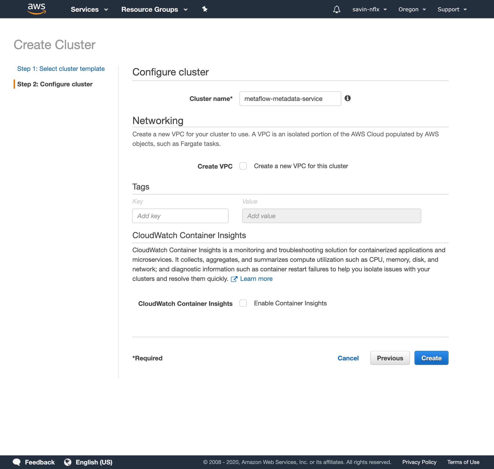

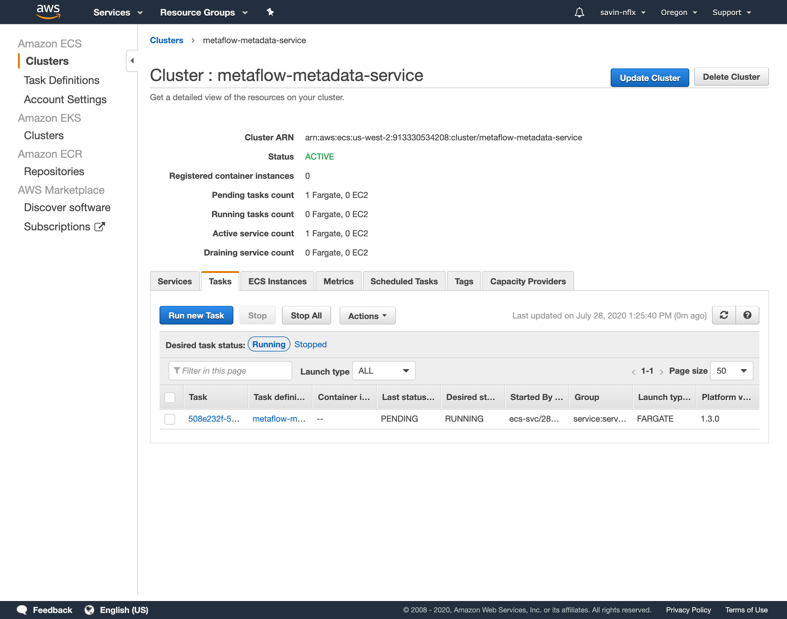

In this example, we created an AWS Fargate cluster `metaflow-metadata-service`. While configuring Metaflow through `metaflow configure aws`, we can set the following values when prompted:

```text
METAFLOW_SERVICE_URL = http://xxx.xxx.xxx.xxx:8080
```

The metadata service in this example is exposed to the internet. Ideally, you would want to put this service behind an API gateway and use authentication in front of it. The [AWS CloudFormation](aws-cloudformation-deployment.md) does that automatically for you. If you need help with manual installation, please [get in touch](../../overview/getting-in-touch.md).

### Scheduling

Using Metaflow, [workflows can be directly scheduled](https://docs.metaflow.org/going-to-production-with-metaflow/scheduling-metaflow-flows) on [AWS Step Functions](https://aws.amazon.com/step-functions/). Moreover, from within Metaflow, time-based triggers can be set to execute these deployed workflows via [Amazon EventBridge](https://aws.amazon.com/eventbridge/). Metaflow currently also has a dependency on [Amazon DynamoDB](https://aws.amazon.com/dynamodb/) for tracking metadata for executing specific steps \(foreaches\) on AWS Step Functions.

#### Create an IAM role for AWS Step Functions

1. Open the [IAM console](https://console.aws.amazon.com/iam/) and in the navigation pane, choose _Roles, Create role_.
2. For _Select type of trusted entity_ section, choose _AWS service_.
3. For _Choose the service that will use this role_, choose _Step Functions_.
4. For _Select your use case_, choose _Step Functions_ and choose _Next: Permissions_.
5. Choose _Next:tags._
6. For _Add tags \(optional\)_, enter any metadata tags you want to associate with the IAM role, and then choose _Next: Review_.
7. For _Role name_, enter a name for your role and then choose _Create role_ to finish.
8. In the [IAM console](https://console.aws.amazon.com/iam/), choose _Roles_ and select the role you created in Step 7.
9. Choose _Attach policies._ Attach _AmazonS3FullAccess, AWSBatchFullAccess, AmazonDynamoDBFullAccess, CloudWatchFullAccess_ and _AmazonEventBridgeFullAccess_ policies_._ Please note that Metaflow doesn't need full access to any of these resources and the [CloudFormation template](aws-cloudformation-deployment.md) tracks the exact set of permissions needed. Please [reach out to us](../../overview/getting-in-touch.md) if you need any assistance.
10. Click on _Attach policy_ and note the ARN of the role created.

#### Create an IAM role for Amazon EventBridge

1. Open the [IAM console](https://console.aws.amazon.com/iam/) and in the navigation pane, choose _Roles, Create role_.
2. For _Select type of trusted entity_ section, choose _AWS service_.
3. For _Choose the service that will use this role_, choose _CloudWatch Events._
4. For _Select your use case_, choose _CloudWatch Events_ and choose _Next: Permissions_.
5. Choose _Next:tags._
6. For _Add tags \(optional\)_, enter any metadata tags you want to associate with the IAM role, and then choose _Next: Review_.
7. For _Role name_, enter a name for your role and then choose _Create role_ to finish.
8. In the [IAM console](https://console.aws.amazon.com/iam/), choose _Roles_ and select the role you created in Step 7.
9. Choose _Attach policies._ Attach _AWSStepFunctionsFullAccess_ policy_._ Please note that Metaflow doesn't need full access to this resource and the [CloudFormation template](aws-cloudformation-deployment.md) tracks the exact set of permissions needed. Please [reach out to us](../../overview/getting-in-touch.md) if you need any assistance.
10. Click on _Attach policy_ and note the ARN of the role created.

#### Create an Amazon DynamoDB table

1. Open the [DynamoDB console](https://console.aws.amazon.com/dynamodb/) and choose _Dashboard_ from the left side pane.
2. Choose _Create Table_.
3. Choose a name for _Table name,_ use _pathspec_ as _Primary key_ and choose _String_ from the dropdown right next to it. Keep _Add sort key_ unchecked.
4. Choose _Create_. After the table has been created, under _Table details,_ choose _Manage TTL_ to open the _Enable TTL_ dialog.
5. Choose _ttl_ for _TTL attribute_ and choose _Continue._

While configuring Metaflow through `metaflow configure aws`, we can set the following values when prompted:

```text
METAFLOW_SFN_IAM_ROLE = [Full ARN of IAM role for AWS Step Functions]
METAFLOW_EVENTS_SFN_ACCESS_IAM_ROLE = [Full ARN of IAM role for AWS EventBridge]
METAFLOW_SFN_DYNAMO_DB_TABLE = [DynamoDB table name]
```

And that's it! Now you should have a full-blown set-up for using all the cloud functionality of Metaflow! In case you need any help, [get in touch](../../overview/getting-in-touch.md).

