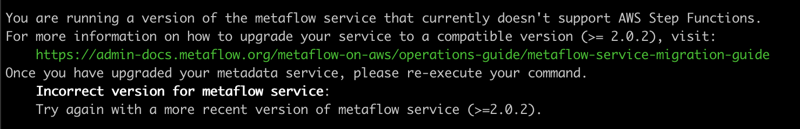

# Metaflow Service Migration Guide

## Metaflow 2.1.+

In Metaflow 2.1.0, we introduced a new AWS service integration with AWS Step Functions. Now, users of Metaflow can easily deploy their flows to AWS Step Functions. If this is a functionality that you would like to use, depending on if/when you deployed the [metaflow service](https://app.gitbook.com/@hawkins/s/metaflow-admin/~/drafts/-MDQ9c_b9eEtHKMgoQni/metaflow-on-aws/metaflow-on-aws#metadata), you might have to take some actions to upgrade your service. If while trying to [schedule your flows](www.google.com) on AWS Step Functions via :

```text
python myflow.py step-functions create
```

you ran into the following error :



then you would need to upgrade the deployed version of your metaflow service. This upgrade requires migration of the backing RDS instance.

 In this situation, the administrator should decide if and when they want to run the migration, which will incur some downtime - up to a few minutes. As a best practice, it is advisable to take a backup of the database prior to the migration which allows you to roll back the migration in case something goes wrong.

\[Add info about  downtime, backup and retries in bold here\]

To make this database migration easy, metaflow service comes with a built-in migration service. When you deploy or restart the [latest version of the metaflow service image](https://hub.docker.com/repository/docker/netflixoss/metaflow_metadata_service), the migration service will detect the schema version of the backing database, and launch the latest version of the metaflow service that is compatible with the database schema. The migration service provides hooks to upgrade the database schema to the latest version so that you can upgrade the metaflow service to the latest version.

There are two paths to upgrading your service, depending on how you first deployed the service - using our [AWS CloudFormation template](metaflow-service-migration-guide.md#aws-cloudformation-deployment) or [manually through the AWS console](metaflow-service-migration-guide.md#manual-deployment). 

## AWS CloudFormation Deployment

If you originally deployed the AWS resources needed for Metaflow using our [AWS CloudFormation template](../deployment-guide/aws-cloudformation-deployment.md), then you can use AWS CloudFormation to spin up the necessary resources for this service migration. The latest version of the AWS CloudFormation template pulls the [latest version of the metaflow service image](https://hub.docker.com/repository/docker/netflixoss/metaflow_metadata_service) which comes bundled with a migration service as well as an AWS Lambda function which you can execute manually to trigger the database migration.

> As mentioned previously, we strongly recommend [taking a backup of your RDS instance](https://docs.aws.amazon.com/AmazonRDS/latest/UserGuide/CHAP_CommonTasks.BackupRestore.html) before proceeding with these steps.

1. Open the [AWS CloudFormation console](https://console.aws.amazon.com/cloudformation) and choose the stack corresponding to your existing deployment.
2. Choose _Update_ and choose _Replace current template_ under _Prerequisite - Prepare template._ 
3. Choose _Upload a template file_ under _Specify template_.
4. Choose _Choose file_ and upload [this template](https://github.com/Netflix/metaflow-tools/blob/master/aws/cloudformation/metaflow-cfn-template.yml). You will have to copy the template to your laptop before you can upload it. Choose _Next._
5. Select your parameters for your deployment


## Manual Deployment

