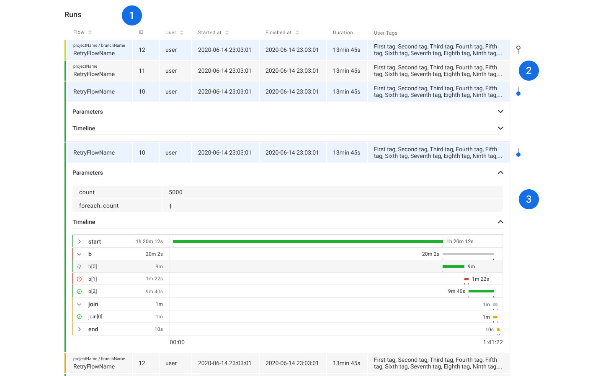

## Home

1. Our header navigation provides you shortcuts to quickly navigate to
   spesific parts of the site.
2. “Quick links” provides useful features for selecting your timezone and
   links to internal and external resources.
3. “Filters” -section provides all the required tools for the user to filter
   out their “Runs” -list.
4. “Runs” -table is a realtime overview of the running Flows within your
   service.

> 

## Header

1. Our site search provides the user with breadcrumb patterns to quickly
   navigate to specific part of the site.
2. Within “Quick links” the user can change the sites timezone. Navigate
   to Notifications or external resources. Also the Application and Service
   versions are presented here.

> 

## Filters

1. “Time frame” -filter always has “Last 30 days” set as default to ensure
   the best possible user experience.
2. With the “Time frame” -filter you can use quick presets or setup a
   custom timeframe.
3. All of the other filter fields have an autocomplete function to make the
   filtering as easy as possible. Also we display the active filters as tags
   beneath the filter inputs.
4. In a scenario when a specific part of the service might be temporarily
   down the inputs display errors for the user.

> 

## "Runs" -table

1. “Runs” -table is updated in realtime to show the latest status of flows
   being run in your service. The list can be ordered by clicking on the
   column headers.
2. Each row has toggle switch on the right side of the table that appears
   when you hover over a row. The toggle opens up a section that
   contains the Flows Parameters and Timeline.
3. You can quickly glance through the flows Parameters and check the
   flows current status from the Timeline.

> 

## "Runs" -table grouping

1. You can change the grouping of the “Runs” -table from the “Group by”
   -select. Currently you can group by flow or user.
2. When you enable grouping we show a maximum of six of the latest
   runs in a group. The table functions the same way as described
   before.
3. Whenever there’s more than six items in a group we provide a “Show
   all runs” -link that will filter the “Runs” -table to only show all of the
   flows within the group.
4. When you scroll through the “Runs” -table we’ll bring forth a “Scroll to
   top” -button to easily get back to top of the table.

> 

## Notifications

1. Notifications is a simple view displaying the history of past
   announcements related to you service.
2. Each notification consists of a simple message, publication date and a
   possible external resource link.
3. An example notification that can popup at any given time anywhere on
   the page, to give you valuable information about upcoming
   maintenances or software updates.

> 

## Run details - Timeline

1. Run details -header contains all of the vital information about you
   current run.
2. Underneath details you’ll find runs parameters and tags.
3. The tab navigation allows you to navigate trough runs DAG, Timeline
   and Task views.
4. “Step collapse” -button allows you to quickly collapse or close the
   steps within a run. The Artifact search input enables you to filter tasks
   with key:value pair searches.
5. “Mode” -select provides you quick presets to filter the timeline.
6. “Order by” -select lets you change the order of the timeline
7. “Status” -select allows you to filter the timeline by task status.
8. Timelines zoom controls.
9. Steps and tasks display a realtime status of how the run is progressing.
10. The timeline displays a graphical presentation of the runs progress in
    realtime.

> 

## Run details - DAG

1. DAG -view fullscreen toggle.
2. Runs DAG map that gives graphical presentation how the different
   steps are separated and how they’re progressing within the run.
3. You can also check the “Developer comments” for each step if the
   developer has provided any.

> 

## Run details - Task details 1/3

1. Each task can consist of multiple attempts. Task details -header
   beneath the tab navigation contains all of the vital information related
   a to specific task within a run.
2. Task details -section contains information related to the tasks
   Metadata, Developer comment and Download link.
3. Metadata is automatically generated data related to the step.

> 

## Run details - Task details 2/3

1. Task related “Developer comments” can be found here.
2. The tasks “Download link” can be found here.

> 

## Run details - Task details 3/3

1. “Std out” -section displays the tasks std out if available and also
   provide tools for downloading or copying the outcome to your
   clipboard.
2. “Std err” -section displays the tasks std err if available.
3. “Artifacts” -table contains all of the artifacts used within the step.
4. You can copy the Python, R or original raw url for each artifact found
   within the “Artifacts” -table.

> 
