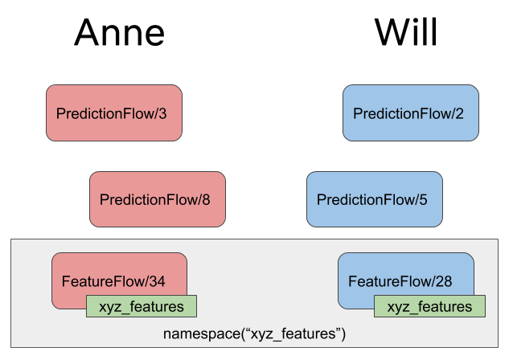

# Organizing Results

A boring, under-appreciated part of high-quality science \(or any project work in general\), is keeping results organized. This is the key to effective collaboration, versioning of parallel lines of work, and reproducibility.

The good news is that Metaflow does 80% of this work for you without you having to do anything. This document explains how Metaflow keeps things organized with a concept called **namespaces** and how you can optionally make results even neater with **tags**.

## Namespaces

As explained in [Basics of Metaflow](basics.md), Metaflow persists all runs and all the data artifacts they produce. Every run gets a unique run ID, e.g. `HelloFlow/546`, which can be used to refer to a specific set of results. You can access these results with the [Client API](client.md).

Many users can use Metaflow concurrently. Imagine that Anne and Will are collaborating on a project that consists of two flows, `PredictionFlow` and `FeatureFlow`. As they, amongst other people, run their versions independently they end up with the following runs:


Anne could analyze her latest `PredictionFlow` results in a notebook by remembering that her latest run is `PredictionFlow/8`. Fortunately, Metaflow makes this even easier thanks to **namespaces**:


When Anne runs `PredictionFlow`, her runs are automatically **tagged** with her user name, prefixed with `user:`. By default, when Anne uses the [Client API](client.md) in an R notebook, RStudio or in an R script, the API only returns results that are tagged with `user:anne`. Instead of having to remember the exact ID of her latest run, she can simply say:

```r
library(metaflow)
run <- flow_client$new('PredictionFlow')$latest_run
```

For Anne, this will return `'PredictionFlow/8'`. For Will, this will return `'PredictionFlow/5'`.

### Switching Namespaces

Namespaces are not about security or access control. They help you to keep results organized. During development, organizing results by the user who produced them is a sensible default.

You can freely explore results produced by other people. In a notebook \(for example\), Anne can write

```r
library(metaflow)
set_namespace('user:will')
run <- flow_client$new('PredictionFlow')$latest_run
```

to see Will's latest results, in this case, `'PredictionFlow/5'`.

You can also access a specific run given its ID directly:

```r
library(metaflow)
run <- flow_client$new('PredictionFlow')$run("5")
```

However, this will fail for Anne, since `PredictionFlow/5` is in Will's namespace. An important feature of namespaces is to make sure that you can't accidentally use someone else's results, which could lead to hard to debug, incorrect analyses.

If Anne wants to access Will's results, she must do so explicitly by switching to Will's namespace:

```r
library(metaflow)
set_namespace('user:will')
run <- flow_client$new('PredictionFlow')$run("5"))
```

In other words, you can use the Client API freely without having to worry about using incorrect results by accident.

If you use the Client API in your flows to access results of other flows, you can use the `--namespace` flag on the command line to switch between namespaces. This is a better approach than hardcoding a `set_namespace()` function call in the code that defines your Metaflow workflow.

### Global Namespace

What if you know a run ID but you don't know whose namespace it belongs to? No worries, you can access all results in the Metaflow universe in the **global namespace**:

```r
library(metaflow)
set_namespace(NULL)
run <- flow_client$new('PredictionFlow')$run("5")
```

Running `set_namespace(NULL)` allows you to access all results without limitations. Be careful though: relative references like `latest_run` make little sense in the global namespace since anyone can produce a new run at any time.

### Resuming across namespaces

[The `resume` command](debugging.md#how-to-use-the-resume-command) is smart enough to work across production and personal namespaces. You can `resume` a production workflow without having to do anything special with namespaces.

You can resume runs of other users and you can resume any production runs. The results of your resumed runs are always created in your personal namespace.

## Tagging

The `user:` tag is assigned by Metaflow automatically. In addition to automatically assigned tags, you can add and remove arbitrary tags in objects. Tags are an excellent way to add extra annotations to runs, tasks etc., which makes it easier for you and other people to find and retrieve results of interest.

An easy way to add tags is the `--tag` command line option. You can add multiple tags with multiple `--tag` options. For instance, this will annotate a `HelloFlow` run with a tag `crazy_test`.

```bash
Rscript helloworld.R run --tag crazy_test
```

The `--tag` option assigns the specified tag to all objects produced by the run: the run itself, its steps, tasks, and data artifacts.

You can access runs \(or steps or tasks\) with a certain tag easily using the Client API:

```r
library(metaflow)
run <- flow_client$new("HelloFlow").runs_with_tags("crazy_test")[[1]]
```

This will return the latest run of `HelloFlow` with a tag `crazy_test` in your namespace. Filtering is performed both based on the current `set_namespace()` and the tag filter.

You can also filter by multiple tags:

```r
library(metaflow)
run <- flow_client$new("HelloFlow").runs_with_tags("crazy_test", "date:2020-06-01")[[1]]
```

This requires that all the tags listed, and the current namespace, are present in the object.

You can see the set of tags assigned to an object with the `.tags` property. In the above case, `run.tags` would return a set with a string `crazy_test` amongst other automatically assigned tags.

### Tags as Namespaces

Let's consider again the earlier example with Anne and Will. They are working on their own versions of `PredictionFlow` but they want to collaborate on `FeatureFlow`. They could add a descriptive tag, say `xyz_features`, to `FeatureFlow` runs.



Now, they can easily get the latest results of `FeatureFlow` regardless of the user who ran the flow:

```r
library(metaflow)
set_namespace('xyz_features')
run <- flow_client$new('FeatureFlow')$latest_run
```

This will return `FeatureFlow/34` which happened to be run by Anne. If Will runs the flow again, his results will be the latest results in this namespace.

We encourage you to use a combination of namespaces, domain-specific tags, and filtering by tags to design a workflow that works well for your project.

## Accessing Current IDs in a Flow

Tagging and namespaces, together with the [Client API](client.md), are the main ways for accessing results of past runs. Metaflow uses these mechanisms to organize and isolate results automatically, so in most cases you don't have to do anything.

However, in some cases you may need to deal with IDs explicitly. For instance, if your flow interacts with external systems, it is a good idea to inform the external system about the identity of the run, so you can trace back any issues to a specific run. Also IDs can come in handy if you need to version externally stored data.

For this purpose, Metaflow provides a singleton object `current` that represents the identity of the currently running task. Use it in your `FlowSpec` to retrieve current IDs of interest:

```r
library(metaflow)

start <- function(self){
    print(paste0("flow name: ", current("flow_name")))
    print(paste0("run id: ", current("run_id")))
    print(paste0("origin run id: ", current("origin_run_id")))
    print(paste0("step name: ", current("step_name")))
    print(paste0("task id: ", current("task_id")))
    print(paste0("pathspec: ", current("pathspec")))
    print(paste0("username: ", current("username")))
}

metaflow("CurrentFlow") %>%
    step(step="start", 
         r_function=start, 
         next_step="end") %>%
    step(step="end") %>% 
    run()
```

You can see the output

```r
2020-06-19 21:19:03.387 [198/start/1139 (pid 64853)] [1] "flow name: CurrentFlow"
2020-06-19 21:19:03.387 [198/start/1139 (pid 64853)] [1] "run id: 198"
2020-06-19 21:19:03.387 [198/start/1139 (pid 64853)] [1] "origin run id: "
2020-06-19 21:19:03.388 [198/start/1139 (pid 64853)] [1] "step name: start"
2020-06-19 21:19:03.388 [198/start/1139 (pid 64853)] [1] "task id: 1139"
2020-06-19 21:19:03.389 [198/start/1139 (pid 64853)] [1] "pathspec: CurrentFlow/198/start/1139"
2020-06-19 21:19:03.389 [198/start/1139 (pid 64853)] [1] "username: jge"
2020-06-19 21:19:08.400 [198/start/1139 (pid 64853)] Task finished successfully.
```

The `current` singleton also provides programmatic access to the CLI option `--origin-run-id` used by the [resume](debugging.md#how-to-use-the-resume-command) within your flow code.

For regular `run` invocations, the value of `current("origin_run_id")` is `NULL`.

If a user explicitly overrides the CLI option `--origin-run-id`, the `current` singleton would reflect that value. Suppose we invoked `resume` for the above script to re-run everything from `start` without explicitly overriding the CLI option `origin-run-id`, we can see the value chosen by Metaflow using the `current` singleton:

```r
Rscript current_flow.R resume start
```

You should see the `origin_run_id` used by the `resume` in the output \(the exact value for you might be different\):

```r
"origin run id: 198"
```

